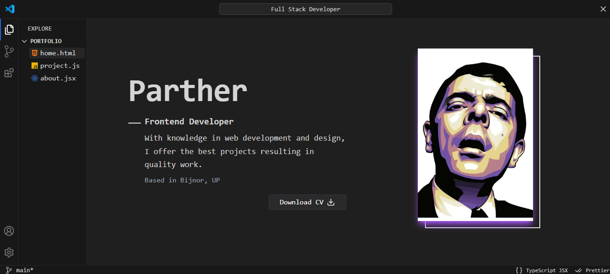

# 🌟 MeParther – Interactive Portfolio with AI

> A modern, interactive personal portfolio built with **Next.js** and **Tailwind CSS**, featuring a **Gemini AI-powered chatbot** that talks to users about me, my projects, and skills.

<p align="center">
  
  <br/>
  <i>Showcasing my work and interacting with visitors in real-time</i>
</p>

---

## 🚀 About MeParther

**MeParther** is a portfolio website that allows visitors to:

- Explore my **projects, skills, and experience**
- Interact with a **chatbot powered by Gemini AI** that answers questions about me
- Get a personalized, conversational experience while learning about my work

It’s built for developers, recruiters, and anyone interested in **an interactive portfolio experience**.

---

## 🧩 Features

- 💬 **Gemini AI Chatbot** – Chat with an AI about my skills and projects
- 🌐 **Next.js & React** – Fast, modern, and server-side rendered
- 🎨 **Tailwind CSS** – Clean, responsive, and mobile-friendly design
- 📂 **Portfolio Showcase** – Highlight projects, skills, and achievements
- ⚡ **Interactive UI** – Smooth transitions and animations

---

## 🛠️ Tech Stack

| Layer | Technology |
|-------|-------------|
| **Frontend** | Next.js, React.js |
| **Styling** | Tailwind CSS |
| **AI Chat** | Google Gemini AI API |
| **Hosting** | Vercel |

---

## ⚙️ Getting Started

### Prerequisites

- Node.js (v16+)
- npm or yarn
- Gemini AI API key from Google

### Installation

```bash
# Clone the repository
git clone https://github.com/parthergk/meparther.git
cd meparther
```
```bash
# Install dependencies
npm install
# or
yarn install
```

Environment Variables

Create a .env.local file at the root and add:
```bash
NEXT_PUBLIC_GEMINI_API_KEY=your_gemini_api_key_here
```

Running Locally
```bash 
# Start development server
npm run dev
# or
yarn dev
